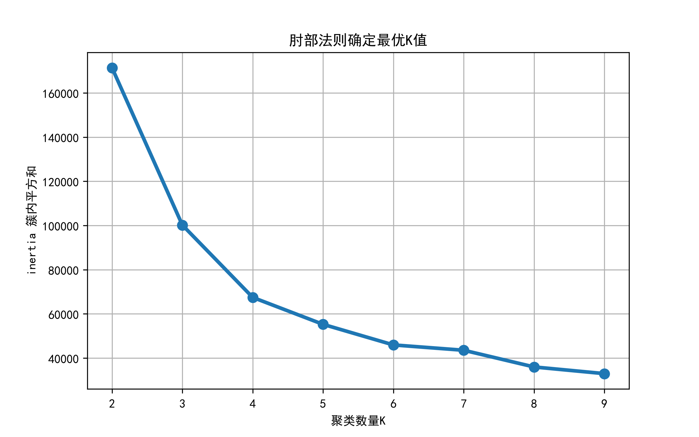
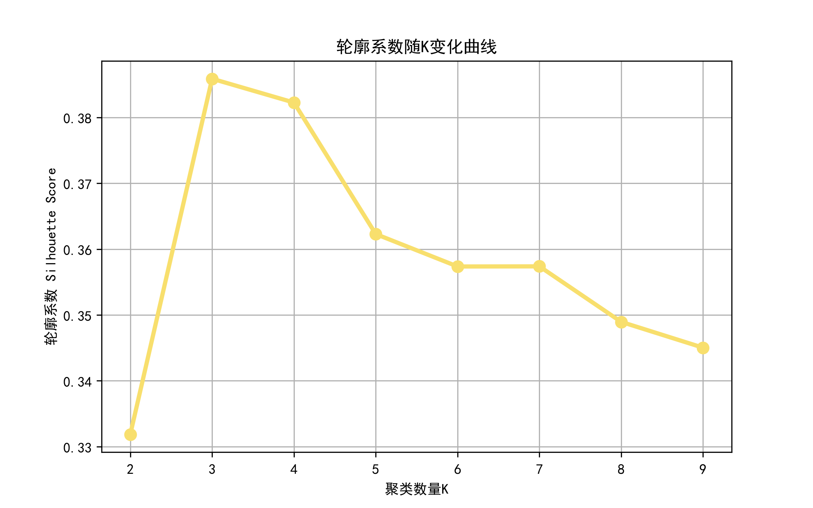
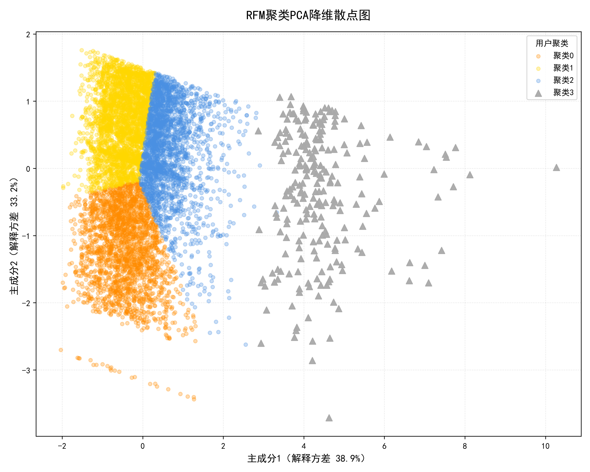
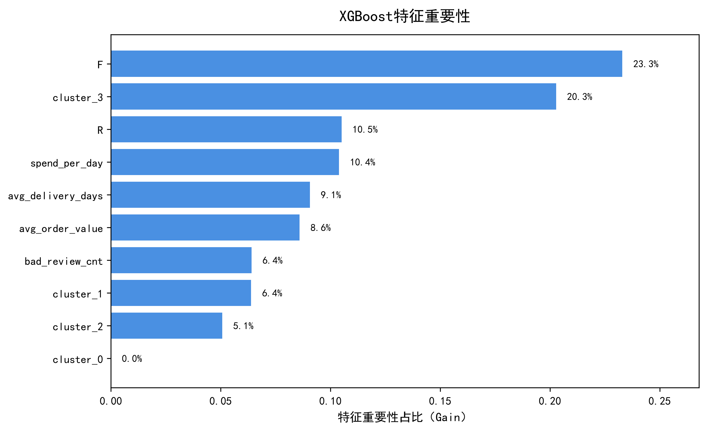
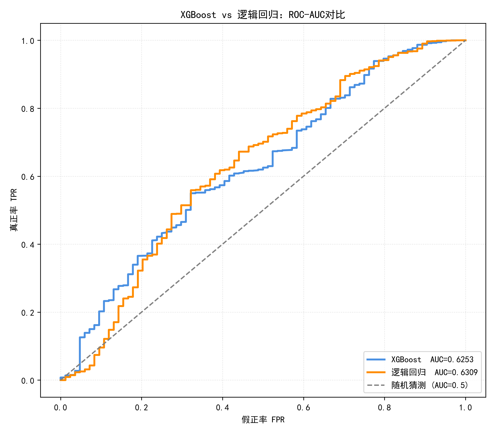
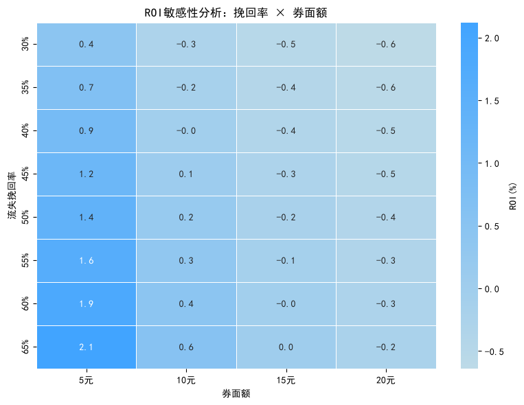
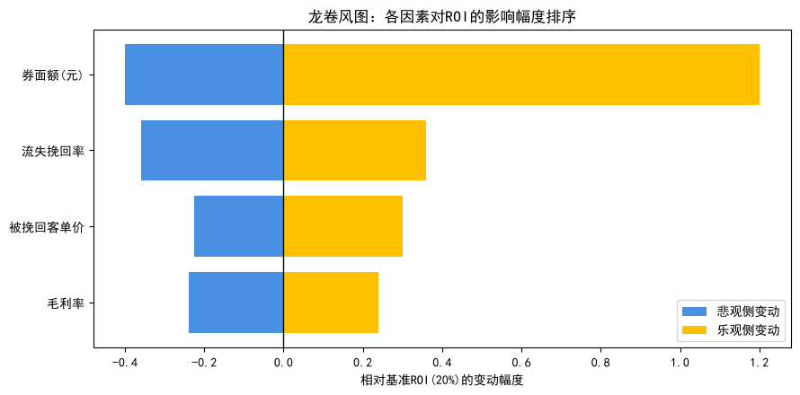

# 电商用户流失预警与精准营销策略分析（Olist 数据集）

> 基于 RFM + K-Means 用户价值分层与 XGBoost 流失预测，识别「高价值 × 高流失风险」客群，并通过优惠券 ROI 与敏感性分析完成可落地的精准营销闭环。


---

## 一、项目背景与业务问题

Olist 是巴西头部电商平台。平台整体复购表现差、用户流失严重，缺乏差异化的用户运营手段，盲目全量发券成本高、效率低。本项目围绕三个业务问题展开：

1. **谁有价值？** —— 用 RFM + K-Means 对用户做价值分层；
2. **谁将流失？** —— 用 XGBoost 预测个体流失风险，并与逻辑回归基准对比；
3. **券该发给谁、划不划算？** —— 叠加价值分层与风险概率圈选目标客群，测算优惠券 ROI 并做敏感性检验。

最终形成「分群 → 预测 → 圈选 → 投放 → 收益测算」的完整数据驱动运营闭环。

---

## 二、数据与口径

- **数据来源**：Kaggle 公开数据集 Olist Brazilian E-Commerce（9 张业务表，含订单、支付、商品、评价、客户、物流等）。原始数据不随仓库分发，字段说明与下载方式见 `data_source.md`。
- **时间窗口切分（严格防时序泄露）**：
  - 观测窗口（构建特征 X）：`2016-09-04 ~ 2018-05-31`
  - 预测窗口（生成流失标签 y）：`2018-06-01 ~ 2018-09-03`，标签信息绝不进入特征。
- **流失定义**：观测窗口内有消费、但预测窗口内无任何复购订单的用户记为流失（`is_churn=1`）。
- **样本特征**：整体流失率 99.44%（一次性购买用户占比极高），属于极端类别不平衡场景，本项目对该特性做了专门处理与说明。

---

## 三、技术栈与方法

| 环节 | 技术 / 方法 |
| ---- | ---- |
| 数据处理 | MySQL（多表关联、窗口切分、用户宽表构建）、Pandas |
| 用户分群 | RFM 指标、log1p 长尾压缩、StandardScaler、K-Means（k=4）、PCA 可视化、轮廓系数 |
| 流失预测 | XGBoost（主模型）、逻辑回归（线性基准）、StratifiedKFold 交叉验证、消融实验 |
| 模型评估 | ROC-AUC、Macro-F1、Recall、累计增益 Gain、Lift |
| 营销策略 | 三级客群筛选、优惠券 ROI 测算、双因素敏感性分析、龙卷风图、规模-效率权衡 |

---

## 四、分析流程（技术路线）

```
MySQL 取数 → 窗口切分 → 构建用户宽表
        ↓
RFM 特征工程 → 特征变换 → K-Means 四类用户分群与业务画像
        ↓
特征矩阵构建（含聚类标签）→ XGBoost vs 逻辑回归 → 消融实验 → 模型评估与特征重要性
        ↓
目标客群（聚类2/3）内模型有效性评估（AUC / Gain / Lift）
        ↓
三级筛选名单 → 满100减10优惠券 → ROI 测算 → 敏感性分析 → 策略建议
```

---

## 五、目录结构

```
项目根目录/
├── README.md                     # 项目说明（本文件）
├── requirements.txt              # Python依赖
├── .gitignore                    # 忽略原始数据与临时文件
├── data_source.md                # 数据来源与字段说明
├── data/                         # 原始数据（不提交到git）
├── sql/                          # MySQL取数、窗口切分、宽表构建脚本
├── notebooks/                    # Jupyter Notebook（RFM聚类、流失预测、ROI分析）
├── outputs/                      # 输出图表与中间结果
│   └── figures/                  # 项目输出图表图片
└── reports/                      # 商业分析报告（PPT/PDF）
```

---

## 六、关键过程与核心结论

### 1. RFM + K-Means 用户分群

- R=距观测截止日的最近消费间隔，F=订单数，M=累计消费金额（Olist `payment_value` 已含运费，不重复计）；
- 对 F、M 做 log1p 压缩长尾，标准化后聚类，结合业务得到 4 类客群；使用肘部法则确定聚类数量，轮廓系数评估聚类效果，PCA降维可视化聚类分布。

<p align="center">
  
  
</p>
<p align="center">
  
</p>

| 聚类 | 业务标签 | 人数 | 特征概要 |
| ---- | ---- | ---- | ---- |
| 0 | 低价值沉睡用户 | 21,949 | 间隔久、频次低、金额低 |
| 1 | 低价值新用户 | 29,331 | 近期首购、金额偏低 |
| 2 | 高价值沉睡用户 | 21,876 | 客单高但久未复购，**挽回优先级最高** |
| 3 | 高价值复购用户 | 2,230 | 频次与金额高，**运营重心、需防流失** |

### 2. 流失预测模型

- 特征：R、F、平均客单价、平均配送时长、差评数、日均消费、聚类标签（剔除与 F、客单价共线的 M）；
- 最终模型：XGBoost（`max_depth=3, learning_rate=0.05, subsample=0.8, colsample_bytree=0.8`，**不使用类别权重**）；
- **消融实验（控制变量）**：
  - 类别权重：加权前后 AUC 无显著差异，但加权使流失召回率由 1.0 降至 0.75（漏掉约 25% 待挽留用户）；且 `scale_pos_weight` 适用于正类为少数的场景，本数据流失为多数类，故不加权；
  - 聚类标签：剔除后 AUC 下降，且标签由观测窗口生成、无时序泄露，故保留。

- 模型对比：

| AUC | XGBoost | 逻辑回归 |
| ---- | ---- | ---- |
| 全量测试集 | 0.6253 | 0.6309 |
| **目标客群（聚类2/3）** | **0.7499** | 0.6422 |

> 全量 AUC 受海量一次性购买用户稀释；在真实投放的高价值客群内 XGBoost 提升明显并反超逻辑回归，验证了选型。极端不平衡下不使用 accuracy 与虚高的 PR-AUC，主用 ROC-AUC、Macro-F1、Gain/Lift。

<p align="center">
  
  
</p>

### 3. 目标客群与营销策略

- **三级筛选漏斗**：聚类 2/3（高价值，24,106 人）→ 历史客单价 ≥ 67 元（回本线）→ 按流失概率取 Top30%（以分位数替代固定 0.75 阈值），生成最终发券名单；
- 券型：满 100 减 10，毛利率 15%，盈亏平衡客单价 = 10 / 15% ≈ 67 元；
- **ROI（基准口径：核销率 6%、挽回率 50%、被挽回客单 160 元）**：ROI = 20%、ROAS = 1.2；
- **敏感性分析**：盈亏平衡挽回率 = 券面额 /（客单 × 毛利率），10 元券仅需 41.7% 挽回率即回本；券面额与挽回率为 ROI 两大敏感因素，20 元券在各情景下均亏损，故选定 10 元面额，方案稳健。

<p align="center">
  
  
</p>

---

## 七、快速开始（复现方式）

```bash
# 1. 克隆仓库
git clone https://github.com/Mia9237/olist-churn-retention.git
cd olist-churn-retention


# 2. 安装依赖
pip install -r requirements.txt

# 3. 按 data_source.md 下载 Olist 数据并放入 data/ 目录
# 4. 依次运行 notebooks/ 下的 Notebook：
#    sql取数 → RFM聚类 → 流失预测 → ROI策略分析
```

`requirements.txt` 主要依赖：

```
pandas
numpy
matplotlib
seaborn
plotly
scikit-learn
xgboost
python-dateutil
mysql-connector-python
jupyter
```

---

## 八、项目亮点（面试向）

1. **严格的时序划分**：观测/预测窗口分离，标签不泄露特征，符合真实风控/营销建模范式；
2. **完整的消融实验**：以控制变量验证类别权重、聚类标签等关键设计，而非主观拍参；
3. **不盲信单一指标**：识别极端不平衡下 accuracy/PR-AUC 的误导性，区分模型视角（AUC）与业务视角（Gain/Lift）；
4. **模型服务于业务**：从分群、概率到财务回本线、ROI 与敏感性分析，形成可执行、可量化收益的营销闭环。

---

## 九、局限与未来优化

> 注：本项目为离线历史数据模拟，无真实线上投放。

- 仅有交易/履约/评价类特征，缺少浏览、加购、收藏等行为序列，模型 AUC 处于弱有效区间；
- 预测窗口仅 3 个月且一次性购买用户占比极高，流失标签存在噪声，可延长窗口做稳健性检验；
- 预测概率未经校准（Platt/Isotonic），当前仅用于风险排序；
- 核销率、挽回率为行业经验假设，上线后应通过 A/B 实验实测回填，并迭代为实时流失预警系统。

---

## 十、数据来源与声明

- 数据来自 Kaggle 公开数据集 [Olist Brazilian E-Commerce](https://www.kaggle.com/datasets/olistbr/brazilian-ecommerce)，仅用于学习与作品集展示；
- 仓库不含原始数据与任何隐私信息；分析结论基于该公开样本，不代表真实经营情况。
